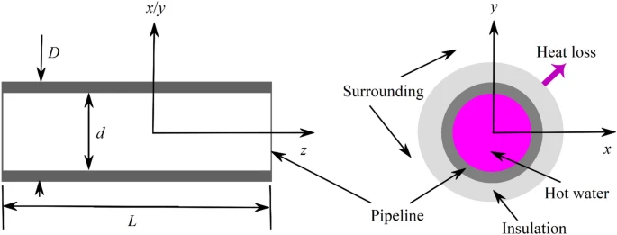

# SIMULATION MODEL

## Running the model

I've setup packages using poetry package manager. First install poetry.
$ pip install poetry

then install the packages
$ poetry install

Run the program:
$ poetry run src/app.py

Run tests with:
poetry run pytest

## Code Challenge Instructions

Physics Simulator Coding Exercise

Write a simple software simulation of the following system.

Minimum Requirements

1. The system should simulate the heat transfer from a solar panel to a storage tank
2. Use whichever coding language you wish
3. We will evaluate thermodynamic correctness, code approach, and results.

## Thoughts on the thermodynamics

Energy In = Solar + Pump Friction (negligible) + outsideEnergy if negative gradient to environment (it's hotter outside than inside - shouldn't be the case in the sim) + friction of water within the pipe (negligible)

simplified as just: Energy In = solar input

Energy Out = -(pipe heat loss + tank heat loss)

Modelling the change in temperature with _flowing_ water would be quite tough.

In general the change in energy is a

change in energy = Energy In - Energy out over time

#### Solar/Heat Collector

immediate energy generated (kWatt second or kJoules) = (SI)(A)(dt)
SI: solar irradiance (kW/m^2)
A: Area of panel (m^2)
dt: change in time (seconds)

#### Pipe heat loss

using the following study on heat transport pipelines:
https://link.springer.com/article/10.1007/s42452-022-05226-2

Thermal resistance of the pipe:
𝑅=𝑙𝑛[(𝐷+𝛿)/𝐷]2𝜋𝜆

R: Thermal resistance per metre (m K W−1)
Insulation thermal conductivity: a decent value of λ = 0.18 W m−1 K−1.
D: outside diameter (meters)
𝛿: insulation thickness(meters)

Heat Loss rate Q:
𝑄= C𝑝 𝐺(𝑇𝑖 − 𝑇𝑠)[1−exp(−𝐿 / C𝑝 𝐺 𝑅)]

Q: kJ/s
With Cp being specific heat of water (assuming constant under pressure - eh good enough): 4.186 kJ/kg\*K
Specific heat at constant pressure (kJ kg−1 K−1)

L: pipeline length (meters)
Ti: Inlet temp of water (Celsius)
Ts: Environment temp or Surrounding Temp (Celsius)
G: the mass flow rate of the hot water (kg/s)

𝐺=(𝜋𝑑\**2/4)*𝜌𝑣
v is it's flow velocity (m per s)
d is inner diameter of the pipe (meters)
p is the density of the hot water (kg/m^3)

### Tank heat loss

using the following resource to create my approximation:
https://www.tec-science.com/thermodynamics/heat/thermal-transmittance-u-value/

I'm using the following equation for heat loss:
Q=U⋅A⋅ΔT⋅Δt

U overall heat transfer coefficient: 0.0003 – 0.0010 k𝑊/𝑚^2𝐾 (lower the better)
A area: m^2
T water: celsius
T ambient: celsius
t time: seconds
