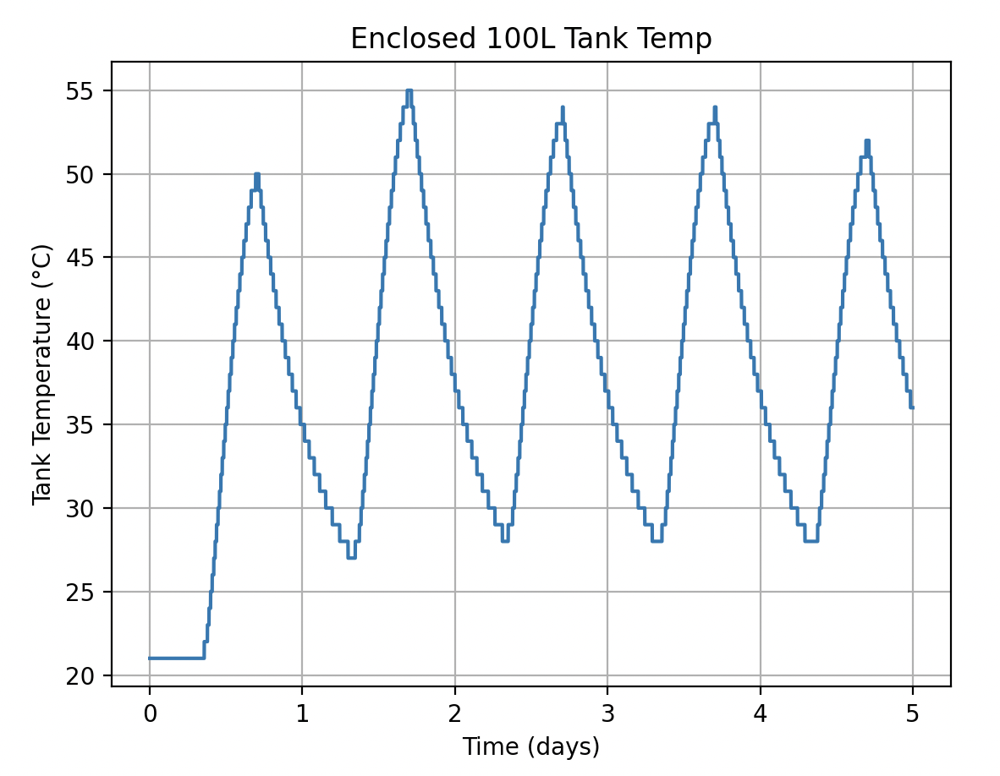

# SIMULATION MODEL

## Running the model

I've setup packages using poetry package manager. First install poetry.

```
$ pip install poetry
```

then install the packages

```
$ poetry install
```

Run the program:

```
$ poetry run src/app.py
```

You will get a graph output like the following, showing tank temp over ~5 days of NSRDB solar irradiance data. Assume pipes and tank enclosed in temp controlled 21 Celsius room.



Run tests with:

```
poetry run pytest
```

## Code Challenge Instructions

Physics Simulator Coding Exercise

Write a simple software simulation of the following system.

Minimum Requirements

1. The system should simulate the heat transfer from a solar panel to a storage tank
2. Use whichever coding language you wish
3. We will evaluate thermodynamic correctness, code approach, and results.

## Thoughts on the thermodynamics

Energy In = Solar + Pump Friction (negligible) + outsideEnergy if negative gradient to environment (it's hotter outside than inside - shouldn't be the case in the sim) + friction of water within the pipe (negligible)

simplified as just:

Energy In = solar input

Energy Out = -(pipe heat loss + tank heat loss)

change in energy = Energy In - Energy out over time

#### Solar/Heat Collector

immediate energy generated (kWatt second or kJoules) = (SI)(A)(dt)

SI: solar irradiance (kW/m^2)

A: Area of panel (m^2)

dt: change in time (seconds)

#### Pipe heat loss

using the following study on heat transport pipelines:
[Heat loss along the pipeline and its control measures](https://link.springer.com/article/10.1007/s42452-022-05226-2)


Thermal resistance of the pipe:
𝑅=𝑙𝑛[(𝐷+𝛿)/𝐷]2𝜋𝜆

R: Thermal resistance per metre (m K W−1)

λ: Insulation thermal conductivity going to make constant of 0.18 W m−1 K−1.

D: outside diameter (meters)

𝛿: insulation thickness(meters)

Heat Loss rate Q:
𝑄= C𝑝 𝐺(𝑇𝑖 − 𝑇𝑠)[1−exp(−𝐿 / C𝑝 𝐺 𝑅)]

Q: kJ/s
With Cp being specific heat of water (assuming constant under pressure - eh good enough): 4.186 kJ/kg\*K
Specific heat at constant pressure (kJ kg−1 K−1)

L: pipeline length (meters)

Ti: Inlet temp of water (Celsius)

Ts: Environment temp or Surrounding Temp (Celsius)

G: the mass flow rate of the hot water (kg/s)

𝐺=(𝜋𝑑\**2/4)*𝜌𝑣

v is it's flow velocity (m per s)

d is inner diameter of the pipe (meters)

p is the density of the hot water (kg/m^3)

### Tank heat loss

using the following resource to create my approximation of tank heat loss:
[Tec Science Page on heat thermodynamics and thermal transmittance](https://www.tec-science.com/thermodynamics/heat/thermal-transmittance-u-value/)

I'm using the following equation for heat loss:

Q = U⋅A⋅ΔT⋅Δt

U overall heat transfer coefficient: 0.0003 – 0.0010 k𝑊/𝑚^2𝐾 (lower the better)

A area: m^2

T water: celsius

T ambient: celsius

t time: seconds

## Assumptions

This is a very open ended assignment, so many assumptions had to be made. I hard coded a lot of values to ensure I could get an approximation, you can find those values at src/values.py.

List of general assumptions I made, and thoughts on those impacts:

- fluid is water (density of 1000 kg/m^3, specific heat of 4.186 kJ/kg celsius, etc )
- the pipes are insulated
- 5 meters of insulated pipe
- the pipes energy loss is pretty much all from tank temperature. Not really a great assumption, since you'd have really hot water coming out of the solar panel. Really would want to model temps coming out of the solar panel, and model 2 separate tubes with 2 different incoming temps and lengths.
- the pump does not add energy to the system, and runs at a flow velocity of 2 m/s for 1" pipes
- the pipes and tank are in a constant temperature location (let's pretend they're inside a temp controlled room of 21c)
- tank starts at 21 degrees celsius
- tank of 100 Liters
- tank area of normal 100L tank at 1.4 meters square
- the tank is _very insulated_ with a tank heat transfer coefficient of 0.0003 kW/m^2 kelvin
- the solar panel maintains constant amazing efficiency of 70%, even though technically the heat gradient would change (debated modeling it as uninsulated piping with it's own outside heated box temperature, but that's a bit out of scope)

## Further Development Thoughts

If this system was made to be more applicable and applied with real env, I'd want to create interfaces to extend off of for each type of part, and then use creational design patterns to build out more complex systems. This would also help you update each part model separately.

You'd likely want to model temp in/temp out of each part to better represent energy loss/creation.

For data management, I'd implement Pandas and data frames to better take advantage of NSRDB data/etc for env.

It wouldn't be terribly hard to have an API with select variables to generate a day of temperature data, and then have a front end animation follow that temp gradient.
